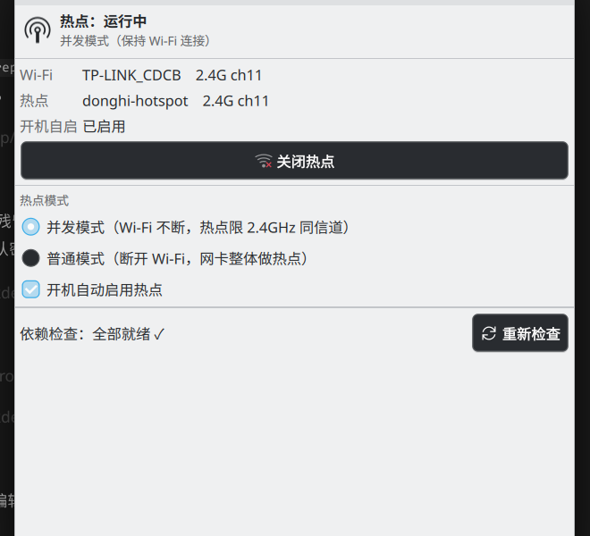

# Plasma Wi-Fi Hotspot Control

A Plasma 6 system-tray applet + privileged backend to switch a Wi-Fi hotspot on/off with one click, in two distinctly different modes.

> [中文文档（主文档）](README.md) — this English page is a summary; the Chinese README is the primary, most up-to-date documentation.

Developed and tested on **Debian 13 + KDE Plasma 6.3 (Intel AX201 / iwlwifi)**.

## Motivation

Windows' Mobile Hotspot can run **while the same Wi-Fi adapter stays connected to a network** —
one radio, online and sharing at the same time. The Linux desktop has no such experience out of the
box (NetworkManager's hotspot kicks the client off). This project exists to bring that Windows
capability to Linux: **run a hotspot without giving up the Wi-Fi connection or plugging in a cable**.
It does so with the concurrent mode (hostapd on a virtual `ap0` interface), while keeping the more
portable normal mode (NetworkManager native hotspot, Wi-Fi disconnected) as a fallback. The
"hotspot follows the Wi-Fi client's channel, never touching the client's band" principle is shared
with [linux-wifi-hotspot](https://github.com/lakinduakash/linux-wifi-hotspot) (create_ap backend).
See the hardware notes below for why concurrent mode falls back to 2.4 GHz on this particular Intel card.



## Features

- **Two hotspot modes** (see below): *concurrent* keeps your Wi-Fi client connected; *normal* turns the whole card into an AP
- **Tray icon reflects state**: a hotspot icon while running; **the same icon with a red slash** (muted-icon style) when off/unavailable; hover shows status, band, channel and client count
- **Live status**: the icon follows external changes too (CLI toggles, the supervisor auto-pausing the hotspot when Wi-Fi roams) — polling every 5 s by default, adjustable 2–60 s
- Panel controls: on/off, mode radio buttons, **start-at-boot** toggle, **dependency self-check** with copy-paste fix commands
- **Change hotspot SSID/password** right in the panel; the running hotspot is restarted automatically so new values take effect; the **current password is viewable** (masked by default, eye button reveals it)
- **Password-free operation**: a polkit rule authorizes exactly one control script (see Security)
- **Bilingual UI follows the system language** (KDE-standard i18n: English source strings, `zh_CN` catalog compiled into the package; regenerate with `./build-translations.sh`. Backend result messages are Chinese-only for now)
- Also installable as a **desktop entry** (app menu / KRunner: "Wi-Fi Hotspot Control") opening the same UI in a standalone window

## The two modes

| | Concurrent mode | Normal mode |
|---|---|---|
| Wi-Fi client | **stays connected** (no speed impact) | **must disconnect** (that's what defines this mode) |
| How | hostapd on a virtual `ap0` interface + dnsmasq + iptables NAT | NetworkManager native hotspot (`ipv4.method shared`, auto DHCP/NAT) |
| Band | **follows the Wi-Fi client's channel** (2.4G→hw_mode g / 5G→a); falls back to 2.4G automatically if the firmware refuses 5G, preference restored on hotspot-off | 2.4 GHz (ch6) |
| Uplink | the current Wi-Fi connection | the default-route device (e.g. ethernet); without uplink it's LAN-only |

## Hardware facts and limitations (measured)

On Intel AX201 + `iwlwifi`:

1. **5 GHz AP is impossible on this firmware (not by principle)** — iwlwifi's regulatory domain is *self-managed* (LAR) and marks all of 5 GHz as NO-IR; `iw reg set` cannot change it (hostapd fails with "Hardware does not support configured channel"). Concurrent mode therefore **follows the Wi-Fi client's channel first** (including 5 GHz, which just works on capable NICs); only when the firmware refuses does it automatically move the client to 2.4 GHz (preference restored on hotspot-off; `FALLBACK_2G=no` disables the downgrade). To unlock true 5 GHz concurrent hotspots on Intel, upstream [linux-wifi-hotspot](https://github.com/lakinduakash/linux-wifi-hotspot) ships [iwlwifi-lar-disable](https://github.com/lakinduakash/linux-wifi-hotspot/tree/master/util/iwlwifi-lar-disable) (DKMS patch adding back `lar_disable=1`); once installed, this project's concurrent mode works on 5 GHz with no further changes. **Measured on this AX201 (ucode 89.4d42c933)**: with the patch, the regulatory unlock worked and hostapd could attempt ch40, but the firmware itself crashed on concurrent 5G AP+STA (`Microcode SW error detected` / `NMI_INTERRUPT_UMAC_FATAL`) — the supervisor fell back to 2.4G automatically and the patched module was reverted (build artifacts kept in `/var/lib/linux-wifi-hotspot/lar/` for easy re-install if a future firmware fixes it). A NIC with good concurrent 5G AP support (e.g. MediaTek mt7921au USB) works out of the box.
2. **STA and AP must share one channel** — the driver allows `{managed} <= 1, {AP} <= 1, #channels <= 1`. That's why the hotspot follows the client's channel: when the client roams to another channel or drops, the supervisor pauses the hotspot and re-establishes it on the client's new channel.
3. **NetworkManager's own hotspot kicks the client off** (it flips the whole NIC from managed to AP). That's why concurrent mode uses hostapd on a virtual interface instead.

This also explains why Windows can do "Wi-Fi + hotspot at once": its Mobile Hotspot uses Wi-Fi Direct (P2P-GO), which this chipset allows on a second channel; plain Linux AP mode has no such path.

## Requirements

- KDE Plasma 6 + Qt6 (**Plasma 5 will not work**), `kpackagetool6`, `org.kde.plasma.plasma5support` — all shipped with Plasma
- NetworkManager, polkit/pkexec, systemd
- Packages: `sudo apt install hostapd dnsmasq iw iptables`
- A NIC that supports AP mode (`iw list` → "Supported interface modes" contains `AP`); concurrent mode additionally needs the managed+AP combination on one channel

## Install

```bash
sudo apt install hostapd dnsmasq iw iptables   # only what's missing
git clone <this repo> && cd plasma-wifi-hotspot
bash install.sh
```

`install.sh` does four things: deploys the backend via pkexec (one auth prompt), installs the plasmoid user-level, installs a desktop entry, and restarts plasmashell. Then:

1. Edit `/etc/kde-hotspot/config` (mode 600) and set your `SSID` / `PASS`. **The backend refuses to start the hotspot with missing credentials** — no default passwords.
2. Add the applet to the system tray: right-click the panel → Edit System Tray → Entries → enable "Wi-Fi 热点控制", or drag it onto the panel.

## Update

```bash
git pull
bash install.sh   # re-syncs backend, updates the plasmoid, restarts plasmashell
```

plasmashell caches QML in memory — an update without the restart keeps the old UI running. `install.sh` handles it.

## Usage / CLI

```bash
pkexec /usr/local/sbin/kde-hotspot-ctl status          # status JSON (includes current SSID/password)
pkexec /usr/local/sbin/kde-hotspot-ctl on|off          # toggle in the current mode
pkexec /usr/local/sbin/kde-hotspot-ctl mode concurrent|normal
pkexec /usr/local/sbin/kde-hotspot-ctl autostart on|off
pkexec /usr/local/sbin/kde-hotspot-ctl set-credentials <SSID> [<new password>]
```

Action commands print one JSON line (`{"ok":true,"message":"…"}`) on stdout — that's what the applet parses.

## Security

- The polkit rule authorizes **only `/usr/local/sbin/kde-hotspot-ctl`** (the action carries an `org.freedesktop.policykit.exec.path` annotation); it cannot run arbitrary commands. Delete `/etc/polkit-1/rules.d/49-kde-hotspot.rules` to restore password prompts.
- Package installation is deliberately **not** inside the password-free scope.
- **Read-only status never goes through pkexec**: the applet polls `kde-hotspot-ctl status` as the normal user (only read-only iw/nmcli/systemctl queries plus reading the config/state flags). This avoids forking a root process and creating a polkit/PAM session on every poll (it used to be once per second, ~86k/day). Privileged operations (on/off/mode/autostart/set-credentials) still use `pkexec`. The polling interval in the applet settings is in **seconds** (default 5, range 2–60).
- The hotspot password lives in `/etc/kde-hotspot/config` (`root:netdev 640` — readable only by root and the network-admin group). That user set matches the one authorized by the polkit rule (sudo/netdev groups run ctl without a password), so the security level is unchanged; it lets the applet read SSID/password/mode without privileges. No default passwords are built in, and the backend refuses to start without a config.
  `status`'s JSON includes the current SSID and password (masked by default in the panel; the eye button reveals it) — if that is unacceptable on a shared machine, drop the `pass` field from `do_status`.
- Non-sensitive state flags (`disabled`, `fallback`) are 644 for the unprivileged status query; `/run/kde-hotspot/hostapd.conf` (contains the password) stays 600.

## Uninstall

See the Chinese README (卸载) for the full script; in short: stop/disable the three `kde-hotspot*` systemd units, remove the backend files (`/usr/local/sbin/kde-hotspot-ctl`, `/usr/local/sbin/kde-hotspot.sh`, the units, the polkit policy + rule, the NetworkManager `conf.d` file, `/etc/kde-hotspot`, `/var/lib/kde-hotspot`), clean up the `ap0` interface and the `kde-hotspot-normal` NM profile if present, then `kpackagetool6 -t Plasma/Applet -r org.kde.hotspot` and remove `~/.local/share/applications/org.kde.hotspot.desktop`.

## Troubleshooting

### Clients connect to the hotspot but report "no internet"

Two common software causes, both handled automatically by this project:

| Cause | Symptom / root cause | Automatic handling |
|---|---|---|
| **Docker (or similar) restarting** | It sets the `FORWARD` chain policy to DROP and flushes third-party rules from that chain → clients associate and get an IP, but every packet is dropped | The supervisor re-checks forwarding/NAT rules every ~3 s and restores them |
| **A proxy in TUN mode** (Clash Verge / mihomo / sing-box…) | It installs policy-routing rules in the 9000 range, steering traffic into its TUN and suppressing the default route → forwarded client packets die as "Network is unreachable" (`IpOutNoRoutes` grows) | Adds a higher-priority rule for the hotspot subnet (`from 10.233.33.0/24 lookup main`, priority 8990, tunable via `RULE_PRIO`) so client traffic bypasses the proxy and goes out directly |

Diagnostics (run as root):

```bash
nstat -az | grep -iE 'noroute|drop'                 # kernel drop counters
ip rule show                                        # proxy policy-routing rules?
ip route get 223.5.5.5 from 10.233.33.50 iif ap0     # route resolution for client traffic
tcpdump -ni ap0 host 10.233.33.50                   # what the client actually sends
```

If client packets do leave but no replies come back, the problem is upstream (router/ISP), not the hotspot.

## Acknowledgments

- **[linux-wifi-hotspot](https://github.com/lakinduakash/linux-wifi-hotspot)** — the channel principle of our concurrent mode ("hotspot follows the Wi-Fi client's current channel, never touching the client's band") was ported from its create_ap backend; its [iwlwifi-lar-disable](https://github.com/lakinduakash/linux-wifi-hotspot/tree/master/util/iwlwifi-lar-disable) utility is also the reference path to unlock 5 GHz concurrent hotspots on Intel NICs
- **[oblique/create_ap](https://github.com/oblique/create_ap)** — the original upstream of that backend (the classic hostapd + dnsmasq + iptables combo)
- **[KDE plasma-nm](https://github.com/KDE/plasma-nm)** — our normal mode builds on the NetworkManager native hotspot managed by plasma-nm

## License

GPL-2.0-or-later (see `LICENSE`).
